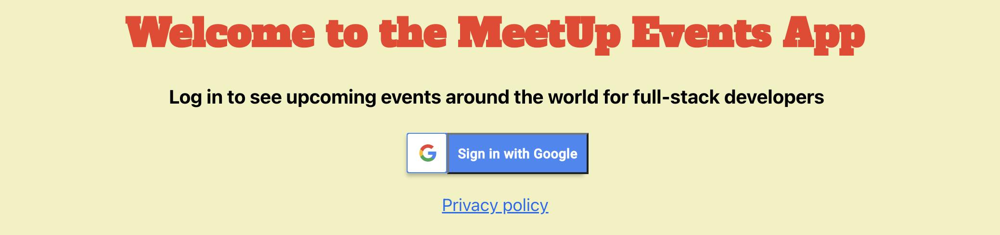

# The MeetUp Event App

## Objective:
To build a serverless, progressive web application (PWA) with React using a test-driven development (TDD) technique. The application uses the Google Calendar API to fetch upcoming events.

## Key Technologies: 
* React - Front End Framework
* Enzyme, Jest, Puppeteer, Jest-Cucumber - Testing
* AWS Lambda, Axios - Deployment and OAuth2
* Google Calendar API

## Key Features: 
* Filter events by city. 
* Show/hide event details. 
* Specify number of events. 
* Use the app when offline. 
* Add an app shortcut to the home screen. 
* Easily view data about upcoming events.

## User Stories and Scenario Tests

### FEATURE 1: FILTER EVENTS BY CITY
**Scenario 1: When user hasn’t searched for a city, show upcoming events from all cities.**  
User Story:  
As a user, 
I should be able to filter events by city
So that I can see he list of events that will take place in that city

Scenario Test:  
Given user hasn’t searched for any city
When the user opens the app
Then the user should see all upcoming events

**Scenario 2: User should see a list of suggestions when they search for a city.**  
User Story:  
As a user,
I should be able easily find my city as a suggestion in the city search
So that I don’t need to type the city or wonder if my city is a choice

Scenario Test:  
Given user main page is open
When the user starts typing on the city textbook
Then the user should see a list of city-suggestions that match what they’ve   input

**Scenario 3: User can select a city from the suggested list.**  
User Story:  
As a user,
I should be able easily select my city of list of suggestions
So that I can more quickly access the event information that I’m looking for

Scenario Test:  
Given user was typing “Hamburg” in the city textbox and the suggestions list is showing
When the user selects a city (e.g.,“Hamburg”) from the list
Then their city should be changed to the chosen city and the user should receive a list of upcoming events from that city

### FEATURE 2: SHOW/HIDE AN EVENT'S DETAILS  
**Scenario 1: An event element is collapsed by default**  
User Story:  
As a user,
I should be able to see clearly that event elements are collapsed
So that I understand they can be opened for more information

Scenario Test:  
Given user is using the app within it’s default setting
When the user sees the event element
Then element is collapsed and obvious that it can be opened

**Scenario 2: User can expand an event to see its details**  
User Story:  
As a user
I should be able to expand an event element
So that I can access more details about the event

Scenario Test:  
Given a user wants to see more details about an event
When the user interacts with the event element
Then it should expand to show details

**Scenario 3: User can collapse an event to hide its details**  
User Story:  
As a user
I should be able to collapse the event details element
So that I can better navigate the app and utilize other functions

Scenario Test:  
Given a user wants to minimize an event details element
When the user interacts with the element
Then it collapses back to the default setting and hides details

### FEATURE 3: SPECIFY NUMBER OF EVENTS
**Scenario 1: When user hasn’t specified a number, 32 is the default number**  
User Story:  
As a user
I should be able to see a default amount of events
So that the app looks full and regular each time

Scenario Test:  
Given a user has not specified a preferred number of events
When the app displays events
Then 32 is the default number displayed

**Scenario 2: User can change the number of events they want to see**  
User Story:  
As a user
I should be able to change the number of events displayed
So that I can control the functionality and experience of the app UI

Scenario Test:  
Given the user wants to change the number of events displayed
When the user views the events list
Then the use can change the preferred number of displayed events

### FEATURE 4: USE THE APP WHEN OFFLINE  
**Scenario 1: Show cached data when there’s no internet connection**  
User Story:  
As a user
I should be able to access recent data
So that I have access to recent activity, even if I lose my connection

Scenario Test:  
Given the application loses connection or experiences slow data speed
When the user wants to access recent event information
Then the app should show cached recent event information

**Scenario 2: Show error when user changes the settings (city, time range)**  
User Story:    
As a user
I should be able to receive a warning if I try to change setting when offline
So that I don’t lose access to cached data on events that may be useful

Scenario Test:    
Given the user wants to change settings
When the app is offline or experiencing slow data speed
Then the app warns the user that they may lose cached event data

### FEATURE 5: DATA VISUALIZATION  
**Scenario 1: Show a chart with the number of upcoming events in each city**  
User Story:  
As a user
I should be able to easily see how many events are happening in each city
So that it’s clear and easy to understand at a glance

Scenario Test:  
Given multiple events in multiple cities
When the user wants to quickly check for events in different cities
Then upcoming events are clearly displayed for easy viewing
